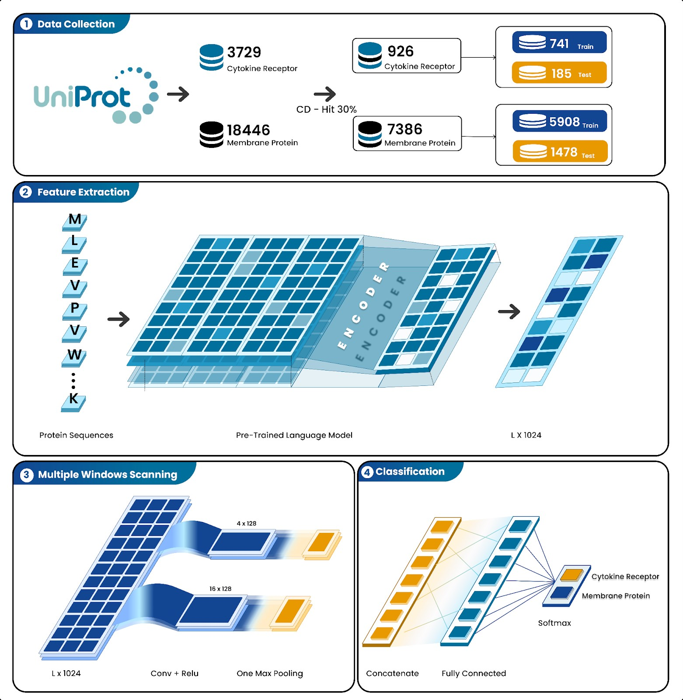

# DeepCytokine
A deep learning technique combining Pre-trained Language Models for highly conserved patterns in recognition of cytokine receptor proteins
# Abstract
Cytokine receptors play a pivotal role in mediating the immune response and are critical in cytokine storms, which underlie the pathogenesis of conditions such as acute respiratory distress syndrome (ARDS) and autoimmune disorders. Identifying cytokine receptors is essential for understanding their biological functions, exploring therapeutic targets, and guiding clinical interventions. Traditional biochemical methods to identify cytokine receptors are labor-intensive, costly, and time-consuming, prompting the need for more efficient alternatives. Recent advances in computational biology have enabled the use of machine learning to classify cytokine receptor proteins; however, existing methods often require extensive feature engineering or rely on limited datasets.
In this study, we present a novel classification framework combining pre-trained protein language models (PLMs) with a multi-window convolutional neural network (mCNN) architecture. PLMs, such as ProtTrans and ESM variants, capture biochemical context directly from raw protein sequences, while mCNN efficiently extracts local and global sequence patterns using convolutional layers with varying window sizes. Our model achieved an AUC of 0.96, demonstrating its effectiveness in distinguishing cytokine receptors from other membrane proteins. By eliminating the need for manual feature extraction, this approach offers a robust and scalable solution for protein classification, paving the way for its application in drug discovery and understanding cytokine-mediated diseases.
# Workflow

# Quick Start
## Feature Generation
Open a terminal (Linux, MACOS) or cmd (Windows), get access to code folder and run the get_ProtTrans.py:
Example:
```markdown
```python
python get_ProtTrans.py -in "path/to/your/fasta/files" -out "path/to/your/embeddings"
## Dataset Generation
After retrieving ProtTrans embedings, you can generate a dataset by using get_dataset.py file:
Example:
```markdown
```python
python get_datatset.py -in "path/to/your/embeddings" -out "path/to/your/file.npy" -dt ".prottrans" -maxseq 500
## Training DeepCytokine
You can train the FASTA files for DeepCytokine model using the quick and easyt-to-follow jupyter notebook: MCNN_Cytokine.pynb
## Test your new data
You can load trained weights and test your new data with aftermcnn.ipynb
